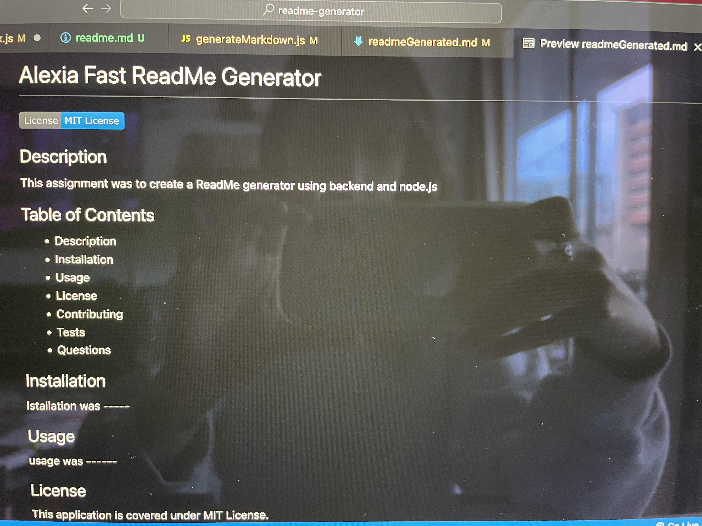

# ReadMe Generator

Author: Alexia Fast

## Description

The assignment was to create a backend application that generates a ReadMe document from a series of user prompts, using node.js. I found this assignment to be pretty straightforward as far as creating the questions for the user and displaying their data on the generated ReadMe file. I was able to render the license using if else statements and attaching individual links. Finding the badges to include on the top of the ReadMe file was fun and rewarding. Some areas of difficulty were creating the functions. However I was bale to understand the purpose and flow of the application. Overall I was able to succesfully complete this assignment. I found working in backend to be very interesting. I'd love to combine backend skills with front end skills in the future.

## See screenshot below

## See link to video walkthrough below

